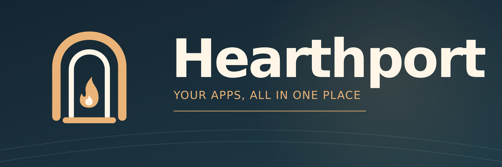

# Hearthport

A self-hosted, Docker-deployable application portal. Users sign in through
[Authentik](https://goauthentik.io/) (OIDC) and see only the applications
Authentik says they are allowed to access.

> Status: Phase 0 (API spike) done; see [docs/spike/phase0.md](docs/spike/phase0.md). The design and roadmap are in [docs/PLAN.md](docs/PLAN.md).

## Brand assets

The editable artwork, favicon, PWA icons, Apple icons, and usage instructions are in [assets/](assets/README.md).
